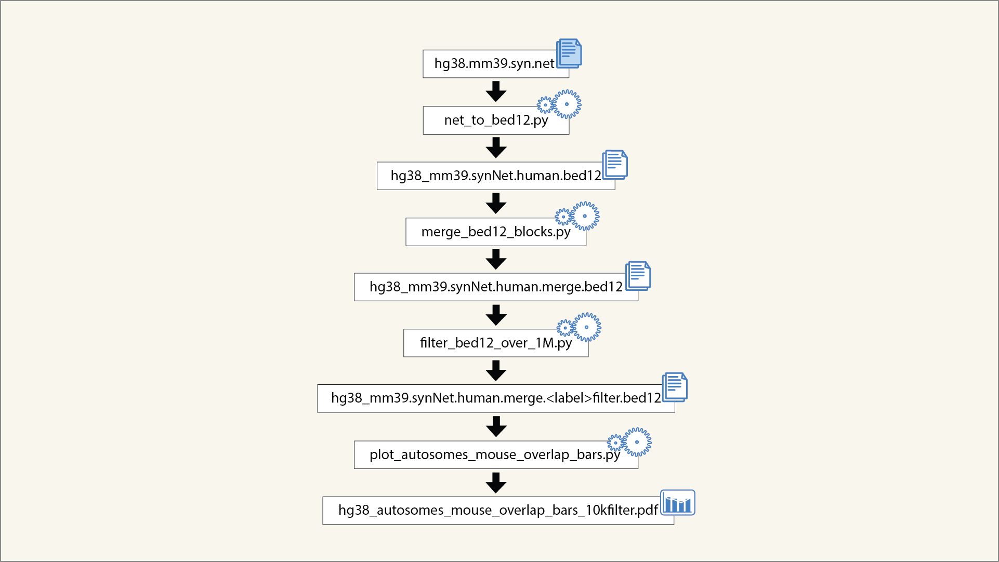

# Synteny map - mapping of mm39 to hg38

## Overview

This repository contains code for creating synteny map figure from target genome hg38 to query genome mm39.

The pipeline processes the synteny net file from UCSC to generate a figure mapping of the mm39 chromosomes to the human chromosomes.

This code was developed as part of an exploratory analysis and reflects the structure used during that process.

---

## Input Data

[UCSC for alignments](https://hgdownload.soe.ucsc.edu/goldenPath/hg38/vsMm39/)

The synteny net file: [hg38.mm39.syn.net.gz](https://hgdownload.soe.ucsc.edu/goldenPath/hg38/vsMm39/hg38.mm39.syn.net.gz)

Chromosome lengths from UCSC: [mm39.chromsizes](https://hgdownload.soe.ucsc.edu/goldenPath/mm39/bigZips/mm39.chrom.sizes), [hg38.chrom.sizes](https://hgdownload.soe.ucsc.edu/goldenPath/hg38/bigZips/hg38.chrom.sizes)

---

## Workflow

The overall pipeline is illustrated below:

Detailed descriptions of inputs, outputs, and functionality are provided in the header of each file.

---

## Output

The Synteny map - see Figures. 

---

## Requirements
- Python 3.9+ (tested with 3.12)
- numpy
- matplotlib

---
## Code Generation

This repository was developed with the assistance of OpenAI Codex.

Code was generated through iterative prompting and subsequently reviewed, modified, and validated by the author.

